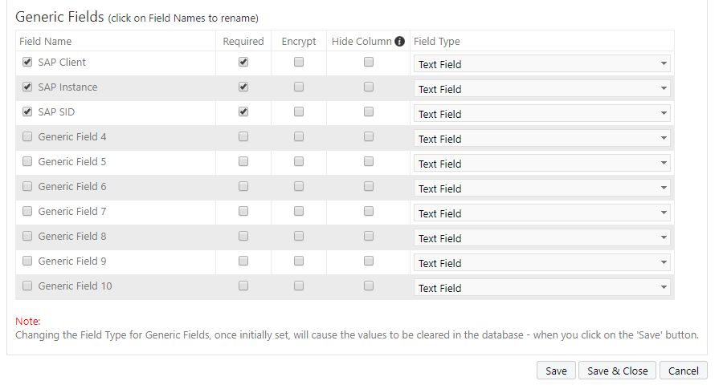

# PasswordState
Plugins for PasswordState from https://www.clickstudios.com.au/

For this plugin to work the following GenericFields needs to be added to the Password List Template.

Note: This plugin requires NCo to be installed on the server, it can be downloaded here: https://support.sap.com/en/product/connectors/msnet.html

